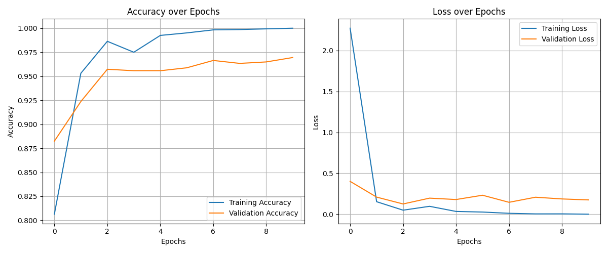

# 🧠 Brain Tumor MRI Classifier

Welcome to the **Brain Tumor MRI Classifier**! This project leverages deep learning to accurately classify brain MRI images into four categories: **glioma**, **meningioma**, **pituitary**, and **no tumor**. With a robust training pipeline and extensive validation, this model demonstrates both high accuracy and strong generalizability across multiple datasets.

---

## 🚀 Project Highlights

- **State-of-the-art CNN** for brain tumor classification
- **Trained on:** [Brain Tumor MRI Dataset (Masoud Nickparvar, Kaggle)](https://www.kaggle.com/datasets/masoudnickparvar/brain-tumor-mri-dataset/data)
- **Validation Accuracy:** ~97% on the original dataset
- **Generalization Test:**  
  - [MRI Brain Tumor Dataset (Mohamad Abouali, Kaggle)](https://www.kaggle.com/datasets/mohamadabouali1/mri-brain-tumor-dataset-4-class-7023-images?utm_source=chatgpt.com)  
  - **BT-MRI Dataset:** 98.5% accuracy  
  - **Challenging Dataset (Blurred):** 95% accuracy
- **Interactive Flask Web App** for easy predictions
- **Training curves** for transparency and insight

---

## 📊 Training Curves



---

## 🗂️ Project Structure

```
.
├── app.py
├── Brain_Tumor_Classifier.py
├── testing.py
├── plotting_graphs.py
├── Brain_Tumor_Results/
│   ├── class_labels.npy
│   ├── training_curves.png
│   └── training_history.pkl
├── templates/
│   └── index.html
```

---

## 🏆 Results

| Dataset Section                | Validation Accuracy |
|------------------------------- |--------------------|
| Original (Masoud Nickparvar)   | ~97%               |
| BT-MRI Dataset (Abouali)       | 98.5%              |
| Challenging (Blurred)          | 95%                |

---

## 💡 How to Use

1. **Clone the repository**
2. **Install dependencies**
   ```sh
   pip install -r requirements.txt
   ```
3. **Run the Flask app**
   ```sh
   python app.py
   ```
4. **Open your browser** and go to `http://127.0.0.1:5000` to upload an MRI image and get predictions!

---

## 📦 Model Details

- **Architecture:** Custom CNN with Conv2D, MaxPooling2D, Dense, Dropout, and BatchNormalization layers
- **Input Size:** 244x244 RGB images
- **Loss:** Categorical Crossentropy
- **Optimizer:** Adam

---

## 📚 Datasets

- **Primary Training/Validation:**  
  [Brain Tumor MRI Dataset (Masoud Nickparvar, Kaggle)](https://www.kaggle.com/datasets/masoudnickparvar/brain-tumor-mri-dataset/data)
- **Generalization/Challenge:**  
  [MRI Brain Tumor Dataset (Mohamad Abouali, Kaggle)](https://www.kaggle.com/datasets/mohamadabouali1/mri-brain-tumor-dataset-4-class-7023-images?utm_source=chatgpt.com)

---

## ✨ Acknowledgements

- Kaggle dataset authors for providing high-quality MRI datasets
- TensorFlow, Keras, Flask, and the open-source community

---

## 📬 Contact

For questions, suggestions, or collaborations, feel free to open an issue or reach out!

---

*Made with ❤️ for medical AI
